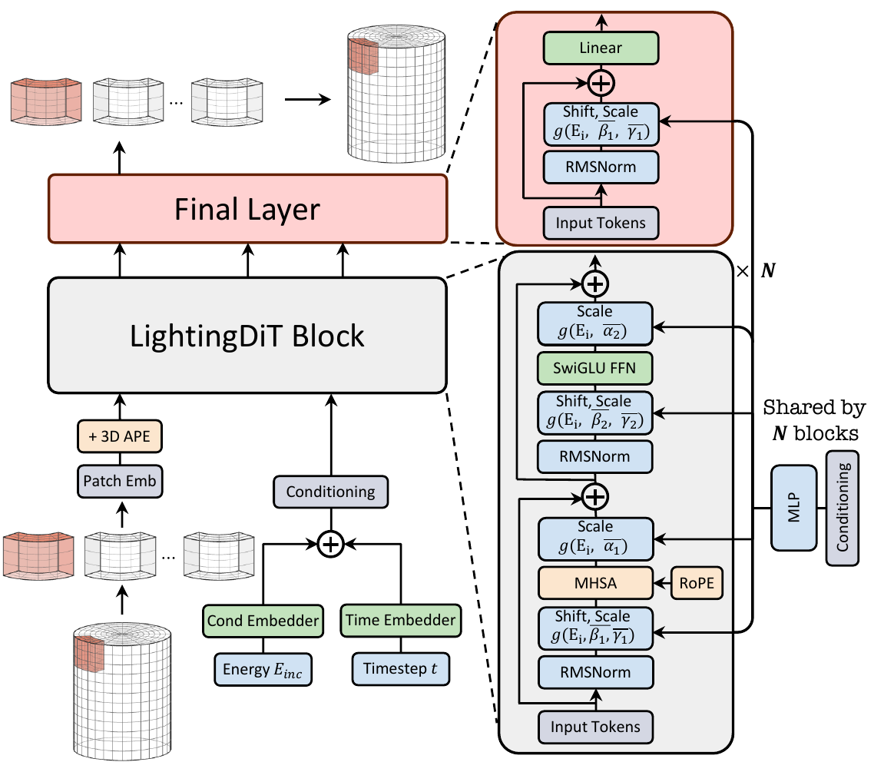

# CaloArt: A 3D Transformer Backbone for Voxel-space Calorimeter Shower Diffusion

[](https://pytorch.org/)
[](https://hydra.cc/)
[](https://arxiv.org/abs/2605.12011)

<p align="center">
  
</p>

This is a PyTorch/GPU implementation of the paper
[CaloArt: Large-Patch x-Prediction Diffusion Transformers for High-Granularity Calorimeter Shower Generation](https://arxiv.org/abs/2605.12011).

CaloArt is a DiT backbone for high-granularity calorimeter shower generation. It operates directly in voxel space with large-patch tokenization, and refines CaloDiT-style full-shower generation through 3D APE+RoPE positional encoding, PixArt-style shared adaLN modulation for timestep and energy conditioning, and LightningDiT block updates including RMSNorm, SwiGLU FFNs, and QK normal. The repository supports linear path flow matching across all nine prediction/loss-space combinations (v, x1, eps) and also provides EDM training and sampling.

This repository is a minimal public branch for reproducing the CaloArt CCD2
PixArt flow-matching experiments. We will continue improving the readability and
reusability of the code, and a more complete release will be made available in a
future update.

Large run artifacts are intentionally not tracked by git. Checkpoints,
TensorBoard events, generated HDF5 files, Weights & Biases runs, and experiment
outputs remain ignored.

## Dataset

Download the CaloChallenge dataset files and place them in your
`CALOCHALLENGE_DATA_DIR`:

| Dataset | DOI |
| --- | --- |
| CCD2 | [](https://doi.org/10.5281/zenodo.6366270) |
| CCD3 | [](https://doi.org/10.5281/zenodo.6366323) |

For the CCD2 configuration in this repository, the directory should contain:

```text
dataset_2_1.hdf5
dataset_2_2.hdf5
```

For CCD3 experiments, download:

```text
dataset_3_1.hdf5
dataset_3_2.hdf5
dataset_3_3.hdf5
dataset_3_4.hdf5
```

Set the dataset directory if it is not in the default cluster location:

```bash
export CALOCHALLENGE_DATA_DIR=/path/to/calochallenge_datasets
```

## Installation

Download the code:

```bash
git clone https://github.com/miemiemi/CaloArt.git
cd CaloArt
```

A suitable conda environment can be created and activated with:

```bash
conda create -n CaloFlow python=3.10
conda activate CaloFlow
pip install -r requirements.txt
```

## Training

Example script for training the CaloArt CCD2 PixArt flow-matching model:

```bash
accelerate launch --multi_gpu --num_processes=2 scripts/train.py \
  --config-name experiment/CaloArt_paper/flow_ccd2_pred_v_loss_v_logit_normal_cond_energy_log10_h384_l6_nh6_patch_3_4_3_pixart_fpd100k
```

On a Slurm cluster:

```bash
sbatch scripts/slurm/train/train_caloart_ccd2_pixart.slurm
```

The default output directory is:

```text
experiments/CaloArt_paper/flow_ccd2_pred_v_loss_v_logit_normal_cond_energy_log10_h384_l6_nh6_patch_3_4_3_pixart_fpd100k
```

## Evaluation

Evaluate an existing checkpoint with the checkpoint-only FPD path:

```bash
export MODEL_PATH=experiments/CaloArt_paper/flow_ccd2_pred_v_loss_v_logit_normal_cond_energy_log10_h384_l6_nh6_patch_3_4_3_pixart_fpd100k/final_model.pt
accelerate launch --num_processes=1 scripts/test_checkpoint.py \
  experiment.output_dir=./experiments \
  experiment.run_name=caloart_ccd2_pixart_checkpoint_fpd \
  model.model_path=${MODEL_PATH} \
  ++train.enable_plots=false \
  ++train.enable_fpd=true \
  ++train.test_num_showers=100000 \
  ++train.fpd_config.save_generated=true \
  ++train.save_generated=true
```

Or submit the Slurm wrapper:

```bash
sbatch scripts/slurm/eval/test_caloart_checkpoint_fpd.slurm
```

To recompute FPD from a saved `generated.h5`:

```bash
GENERATED_FILE=/path/to/generated.h5 \
REFERENCE_FILE=${CALOCHALLENGE_DATA_DIR}/dataset_2_2.hdf5 \
sbatch scripts/slurm/eval/compute_fpd_from_h5.slurm
```

## Configuration

This public branch keeps the source code and the single paper configuration
needed to train and evaluate the CCD2 model:

- `configs/data/ccd2.yaml`
- `configs/preprocessing/ccd2_cond_energy_log10.yaml`
- `configs/model/calolightning_h384_ape_rope_c192_96_96_sharemod_rmsnorm_nh6_patch_3_4_3_pixart.yaml`
- `configs/method/flow_matching/logit_normal.yaml`
- `configs/sampling/flow/heun_32.yaml`
- `configs/experiment/CaloArt_paper/flow_ccd2_pred_v_loss_v_logit_normal_cond_energy_log10_h384_l6_nh6_patch_3_4_3_pixart_fpd100k.yaml`

## Citation

If you use this codebase in your research, please consider citing:

```bibtex
@article{Huang2026CaloArt,
  title = "{CaloArt: Large-Patch x-Prediction Diffusion Transformers for High-Granularity Calorimeter Shower Generation}",
  author = "Huang, Zhengkun and Sun, Gongxing",
  eprint = "2605.12011",
  archivePrefix = "arXiv",
  primaryClass = "physics.ins-det",
  year = "2026"
}
```

## Acknowledgements

This work builds on [VisionTransformers4HEP](https://github.com/luigifvr/vit4hep),
[CaloDitv2](https://github.com/cargicar/CaloDitv2),
[LightningDiT](https://github.com/hustvl/LightningDiT), and
[JiT](https://github.com/LTH14/JiT). We thank the
[CaloChallenge](https://calochallenge.github.io/homepage/) organizers for
providing the benchmark, datasets, and evaluation setting used by this work.
